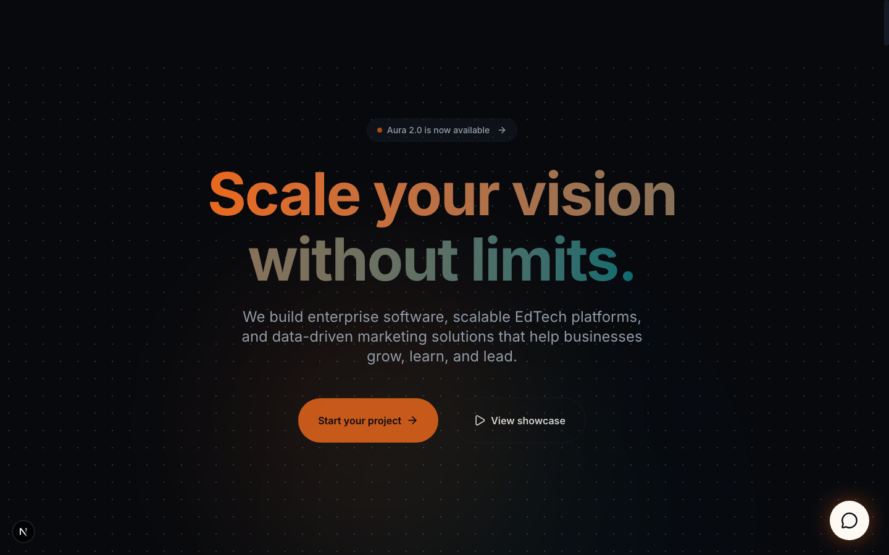
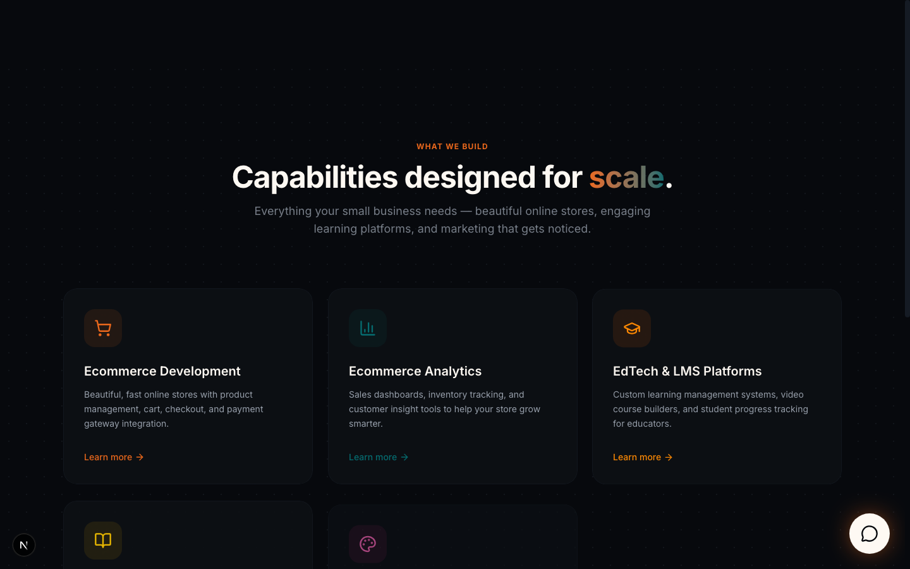
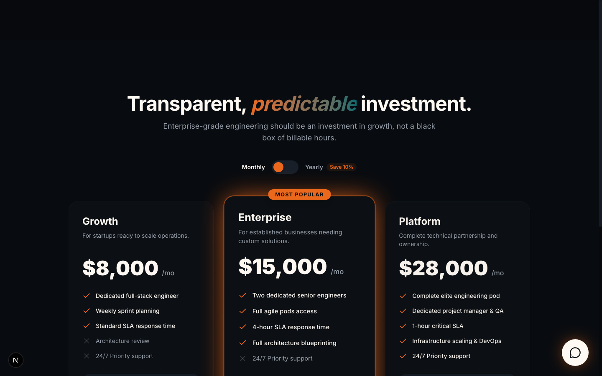

# Aura — Enterprise SaaS Website

A modern, full-featured SaaS marketing website built with **Next.js 15**, **TypeScript**, **Tailwind CSS**, and **Framer Motion**. Supports English and Tamil (i18n), dark mode, and smooth scroll animations.

## Live Demo

> Deployed via Vercel — link added after first deployment.

## Screenshots

| Hero | Services | Pricing |
|------|----------|---------|
|  |  |  |

> Screenshots are captured from the live deployment.

## What This Site Covers

- **Software Development** — Enterprise software, cloud architecture, workflow automation, data platforms, payment systems
- **Teaching & Education** — EdTech & LMS platforms, interactive course builders, student progress dashboards
- **Digital Marketing** — Marketing automation, SEO infrastructure, brand & content strategy, campaign analytics

## Tech Stack

| Layer | Technology |
|-------|-----------|
| Framework | Next.js 15 (App Router) |
| Language | TypeScript |
| Styling | Tailwind CSS v4 |
| Animation | Framer Motion |
| i18n | next-intl (EN + Tamil) |
| UI Components | Radix UI + shadcn/ui |
| Icons | Lucide React |
| Deployment | Vercel |

## Sections

- **Hero** — Animated headline with CTA buttons
- **Services** — 9-card tilt-on-hover grid (Software, EdTech, Marketing)
- **Process** — 6-step delivery methodology
- **Case Studies** — Proof-of-impact showcase
- **Tech Stack** — Marquee logo strip
- **Social Proof** — Testimonials + trust signals
- **Pricing** — Monthly/yearly toggle with three tiers
- **FAQ** — Accordion with software, teaching, and marketing FAQs
- **CTA** — Email capture with mailto integration
- **Footer** — Navigation + links

## Getting Started

```bash
npm install
npm run dev
```

Open [http://localhost:3000](http://localhost:3000).

## i18n

Switch language via the navbar toggle. Translations live in:
- `src/messages/en.json` — English
- `src/messages/ta.json` — Tamil

## Project Structure

```
src/
├── app/[locale]/       # Locale-aware layouts and pages
├── components/
│   ├── layout/         # Navbar, Footer
│   ├── sections/       # All page sections
│   └── ui/             # Shared UI primitives
├── messages/           # i18n translation files
└── i18n/               # next-intl routing config
```

## Deployment

Connect the GitHub repo to [Vercel](https://vercel.com). Every push to `main` triggers an automatic deployment.

## Branch Policy

Direct pushes to `main` are restricted to the repository owner. All contributions must go through a pull request.

## License

MIT © 2026 Aura Software Studio
